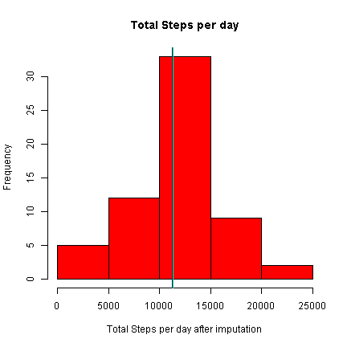

```r
library(lattice)
library(mice)
```

## Loading and preprocessing the data
Data is loaded from the provided URL, the code checks for pre-existing files and if not found, it is downloaded and unzipped.Then the unzipped file is loaded into an object and date is converted from string to POSIXlt object

```r
zipName<-"Motion.zip"
UnzipFile<-"activity.csv"
DURL<-"https://d396qusza40orc.cloudfront.net/repdata%2Fdata%2Factivity.zip"

#Downloading and unzipping (if not done already)
if(!file.exists(zipName))
  download.file(DURL,zipName)
if(!file.exists(UnzipFile))
  unzip(zipName)

steps<-read.csv(UnzipFile)
steps$date<-as.Date(steps$date,"%Y-%m-%d")
```

## What is mean total number of steps taken per day?
##### 1. Calculate the total number of steps taken per day

```r
totSteps<-tapply(steps$steps,steps$date,sum,na.rm=TRUE)
```
##### 2. Calculate and report the mean and median of total number of steps taken per day  

```r
MeanStepsPerDay<-mean(totSteps)
MedianStepsPerDay<-median(totSteps)
```
* Mean= 9354.2295082  
* Median= 10395     

##### 3. Make a histogram of the total number of steps taken each day


```r
hist(totSteps,xlab="Total Steps per day",col="red",main="Total Steps per day")
abline(v=MeanStepsPerDay,col="blue")
abline(v=MedianStepsPerDay,col="green")
```

 


## What is the average daily activity pattern?
##### 1. Make a time series plot (i.e. type = "l") of the 5-minute interval (x-axis) and the average number of steps taken, averaged across all days (y-axis)

```r
totStepsInInterval<-tapply(steps$steps,steps$interval,mean,na.rm=TRUE)
```

```r
plot(totStepsInInterval,type="l",col="red",xlab="5-min Interval", 
      ylab="Daily average of Steps",main="Daily Activity Pattern")
abline(h=mean(totStepsInInterval),col="blue")
abline(h=median(totStepsInInterval),col="green")
```

 
  
##### 2. Which 5-minute interval, on average across all the days in the dataset, contains the maximum number of steps?

```r
maxInt<-names(which.max(totStepsInInterval))
```
* Max value interval=835

## Imputing missing values
The imputation is done using mice package for R using the predictive mean matching method  
* technical reference : http://www.stefvanbuuren.nl/publications/MICE%20in%20R%20-%20Draft.pdf  
* helpful read : http://www.r-bloggers.com/imputing-missing-data-with-r-mice-package/  

##### 1.Calculate and report the total number of missing values in the dataset (i.e. the total number of rows with NAs)

```r
misValues<-nrow(steps[is.na(steps$steps),])
```
  
* Missing Values= 2304  

##### 2.Devise a strategy for filling in all of the missing values in the dataset.

```r
impData<-steps
tempData<-impData
tempData$date<-as.numeric(impData$date)
invisible(tempData<-mice(tempData,method="pmm"))
```
##### 3.Create a new dataset that is equal to the original dataset but with the missing data filled in

```r
impData<-complete(tempData,5)
rm(tempData)
impData$date<-steps$date
```
##### 4.Make a histogram of the total number of steps taken each day and Calculate and report the mean and median total number of steps taken per day

```r
itotSteps<-tapply(impData$steps,impData$date,sum,na.rm=TRUE)
iMeanStepsPerDay<-mean(itotSteps)
iMedianStepsPerDay<-median(itotSteps)
hist(itotSteps,xlab="Total Steps per day after imputation",
      col="red",main="Total Steps per day")
abline(v=iMeanStepsPerDay,col="blue")
abline(v=iMedianStepsPerDay,col="green")
```

 

* Mean with imputed data=1.1210574 &times; 10<sup>4</sup>  

* Median with imputed data= 11352

* Difference in mean after imputatuion= 1856.3442623 

* Difference in median after imputation = 957  

## Are there differences in activity patterns between weekdays and weekends?

```r
impData$Dtype<-ifelse(weekdays(impData$date) %in% c("Saturday","Sunday"),
                      "weekend","weekday")
impData$Dtype<-as.factor(impData$Dtype)
WimpData<-aggregate(steps~Dtype+interval,impData,mean)
xyplot(WimpData$steps~WimpData$interval|WimpData$Dtype,type="l",xlab="Interval",
        ylab="Average of steps over days")
```

 
